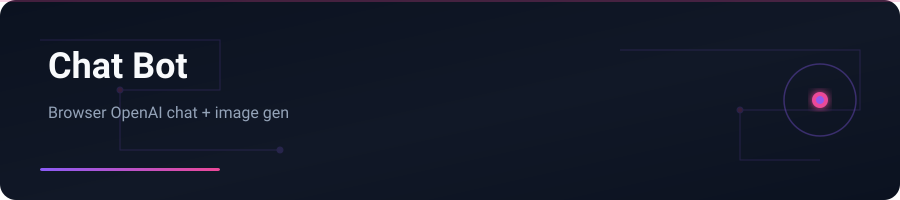

<div align="center">



</div>

# Chat Bot

Single-page OpenAI chat (streaming) + image generation — runs entirely in the browser.

---

## English


### Features

- Streaming text chat (ChatGPT-style)
- Image generation mode (DALL·E / gpt-image)
- File uploads (text + vision images)
- Multiple conversations with history in `localStorage`
- Configurable model, image model, and system prompt
- JSON export / import backup

### Stack

HTML · CSS · JavaScript · OpenAI API

### Getting started

```bash
git clone https://github.com/yasinfallahati/chat-bot.git
cd chat-bot/gpt-chat
python3 -m http.server 8000
# open http://localhost:8000 — set your API key in Settings
```
**Security:** API key stays in your browser `localStorage` and is sent only to OpenAI. Do not host this publicly with your personal key.

---

## فارسی

### چت‌بات

چت استریم OpenAI + تولید تصویر — کاملاً در مرورگر، بدون بک‌اند.


### امکانات

- گفتگوی متنی با استریم پاسخ
- حالت تولید تصویر
- آپلود فایل متنی و تصویر vision
- چند گفتگو با تاریخچه در `localStorage`
- تنظیم مدل، مدل تصویر و System Prompt
- پشتیبان‌گیری Export/Import به JSON

### تکنولوژی‌ها

HTML · CSS · JavaScript · OpenAI API

### شروع کار

```bash
git clone https://github.com/yasinfallahati/chat-bot.git
cd chat-bot/gpt-chat
python3 -m http.server 8000
```
کلید API فقط در `localStorage` مرورگر شماست. برای انتشار عمومی، بک‌اند واسط بسازید.

---

`#openai` `#chatgpt` `#javascript` `#browser` `#dalle` `#chatbot`
