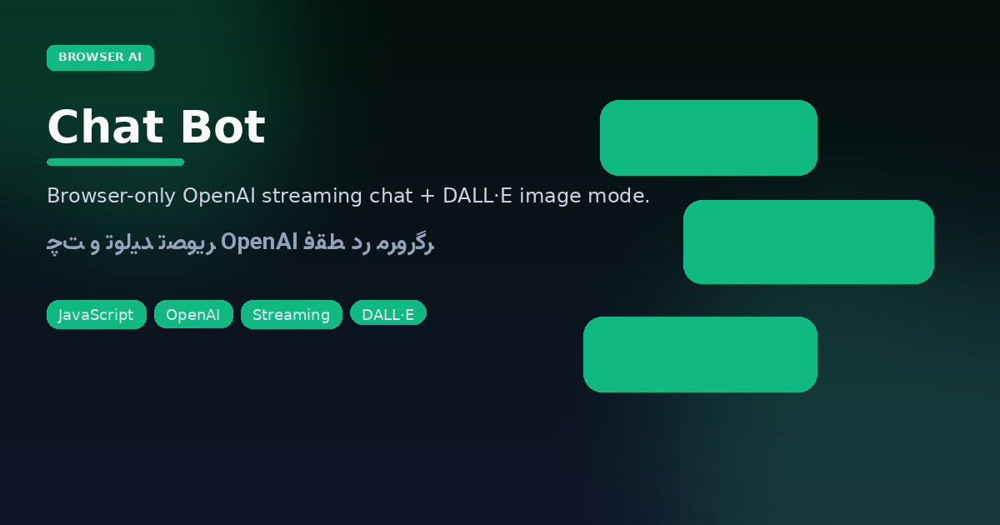
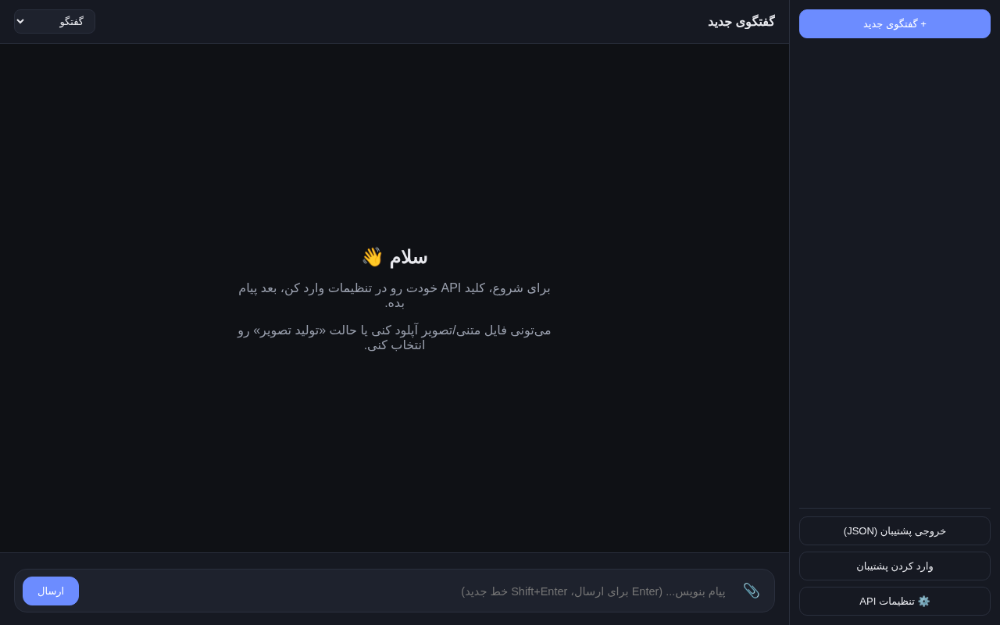

<p align="center"></p>

# Chat Bot — browser OpenAI desk

<p align="center">


</p>

<p align="center"></p>

**No Node server required for the UI.** Drop `gpt-chat/` behind any static host (or `python -m http.server`), paste your API key in Settings, and you get streaming chat + image mode with conversation history in `localStorage`.

## Quick start

```bash
cd gpt-chat
python3 -m http.server 8000
# open http://localhost:8000 — set API key in Settings
```

## Product surface

| Control | Role |
|---------|------|
| Sidebar | Conversation list, new chat, backup import/export |
| Mode select | `گفتگو` (chat) · `تولید تصویر` (image) |
| Settings | API key + endpoint knobs (stay local to the browser) |

Persian-first chrome (`dir=rtl`). Prefer this repo over the empty **chat-bot-** archive.

---

## فارسی — چت‌بات مرورگری

رابط تک‌صفحه‌ای برای **گفتگوی استریم OpenAI** و **تولید تصویر**؛ تاریخچه در `localStorage`، پشتیبان JSON، و تنظیمات API داخل خود مرورگر. بدون بک‌اند اختصاصی برای UI.

### شروع سریع

```bash
cd gpt-chat && python3 -m http.server 8000
```

سپس کلید API را از منوی تنظیمات وارد کنید.

### تفاوت با chat-bot-

ریپوی `chat-bot-` فقط اسکلت قدیمی است؛ **اینجا** UI کامل مرورگر قرار دارد.
